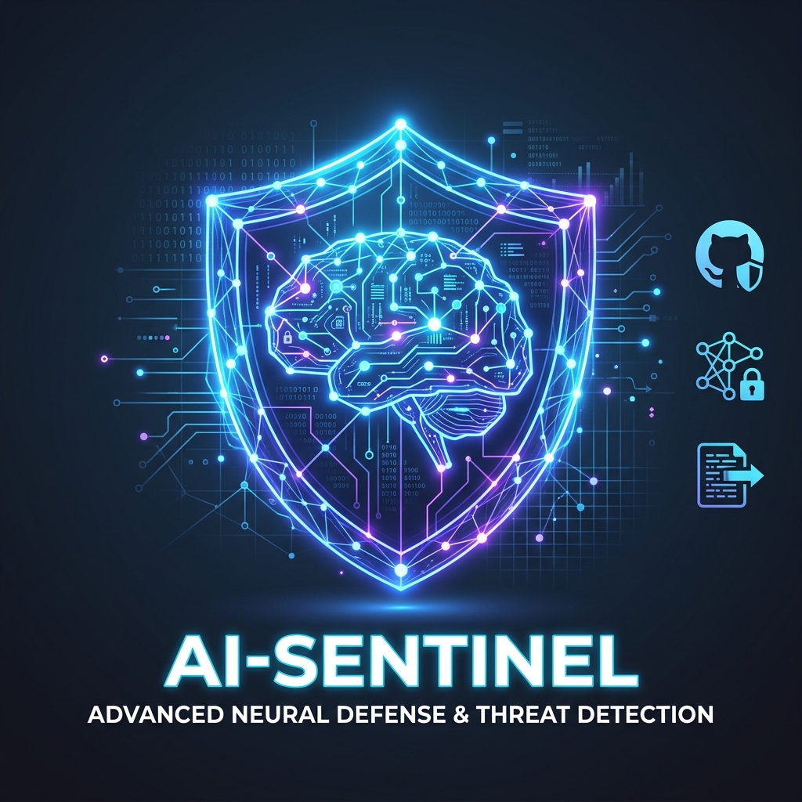
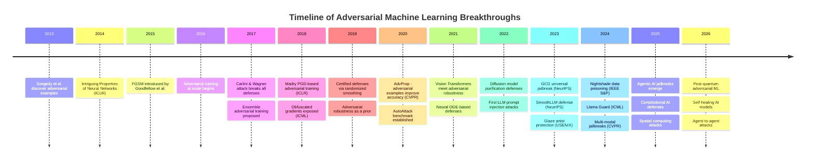
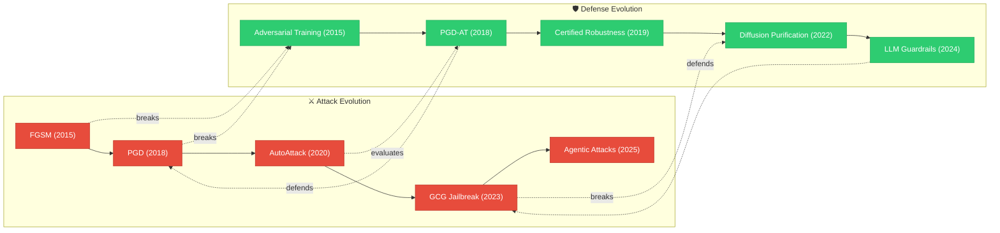
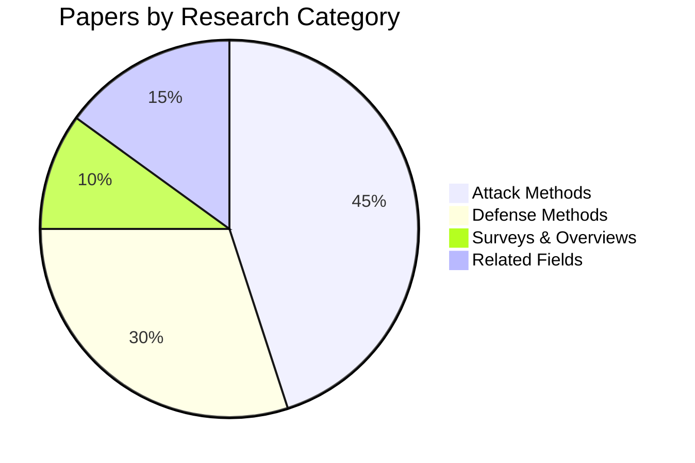

<div align="center">



# 🛡️ Adversarial Defense Methods

### The World's Most Comprehensive Archive of Adversarial Machine Learning Research

[](https://github.com/DevChiniwala/adversarial-defense-methods)
[](https://github.com/DevChiniwala/adversarial-defense-methods)
[](LICENSE)
[](https://github.com/DevChiniwala/adversarial-defense-methods/issues)

<br/>

*A meticulously curated, year-by-year directory of the highest-quality research papers in Adversarial ML, AI Security, Robustness, and Privacy — spanning from the foundational discoveries of 2013 to the cutting-edge LLM security research of 2026.*

<br/>

[Explore Papers](#-browse-by-year) · [Taxonomy](#-research-taxonomy) · [How to Use](#-how-to-use-this-repository) · [Contribute](#-contributing)

---

</div>

## 🌟 Why This Repository?

> Traditional paper lists are flat, unsorted, and overwhelming. This repository is **different**. Every single paper has its own dedicated file containing a **BibTeX citation**, a concise **Motivation** (why the research matters), a clear **Contribution** (what's novel), and a **Summary** — making it the fastest way to navigate 14 years of adversarial ML research.

<br/>

## 🗺️ Research Taxonomy

The following flowchart illustrates how the field of Adversarial Machine Learning is organized within this repository:

```mermaid
graph TD
    A["🛡️ Adversarial Machine Learning"] --> B["⚔️ Attack Methods"]
    A --> C["🔒 Defense Methods"]
    A --> D["📊 Surveys & Overviews"]
    A --> E["🔗 Related Fields"]

    B --> B1["White-box Attacks"]
    B --> B2["Black-box Attacks"]
    B --> B3["Physical Attacks"]
    B --> B4["Poisoning & Backdoors"]
    B --> B5["LLM Jailbreaks & Prompt Injection"]

    C --> C1["Adversarial Training"]
    C --> C2["Certified Robustness"]
    C --> C3["Adversarial Purification"]
    C --> C4["LLM Alignment & Guardrails"]

    D --> D1["Comprehensive Surveys"]
    D --> D2["Benchmarks & Evaluations"]

    E --> E1["Interpretability & Explainability"]
    E --> E2["Deepfakes & Generative AI Security"]
    E --> E3["Federated Learning Privacy"]
    E --> E4["Dataset Distillation"]

    style A fill:#6C3483,stroke:#5B2C6F,color:#FFFFFF,stroke-width:3px
    style B fill:#E74C3C,stroke:#C0392B,color:#FFFFFF,stroke-width:2px
    style C fill:#2ECC71,stroke:#27AE60,color:#FFFFFF,stroke-width:2px
    style D fill:#3498DB,stroke:#2980B9,color:#FFFFFF,stroke-width:2px
    style E fill:#F39C12,stroke:#E67E22,color:#FFFFFF,stroke-width:2px
```



<br/>

## 📚 Browse by Year

Click on any year below to explore the full, categorized list of papers and their individual summaries:

| Era | Years | Focus |
|:---:|:------|:------|
| 🌱 **Foundation** | [**2013**](./2013/) · [**2014**](./2014/) · [**2015**](./2015/) | Discovery of adversarial examples, FGSM, early defenses |
| 🔬 **Expansion** | [**2016**](./2016/) · [**2017**](./2017/) · [**2018**](./2018/) | C&W attack, PGD adversarial training, certified robustness |
| 🚀 **Maturity** | [**2019**](./2019/) · [**2020**](./2020/) · [**2021**](./2021/) | AutoAttack, AdvProp, robustness benchmarks, neural ODE defenses |
| 🧠 **Generative AI** | [**2022**](./2022/) · [**2023**](./2023/) · [**2024**](./2024/) | LLM jailbreaks, diffusion model attacks, prompt injection, RAG poisoning |
| 🔮 **Frontier** | [**2025**](./2025/) · [**2026**](./2026/) | Agentic AI attacks, post-quantum adversarial ML, self-healing models |

<br/>

## 📈 Evolution of the Field

The following diagram traces the landmark papers and paradigm shifts across the history of adversarial ML:



<br/>

## 🧬 Attack vs. Defense Arms Race



<br/>

## 📂 Repository Structure

```
adversarial-defense-methods/
│
├── 📁 2013/                          # Foundation era
│   ├── README.md                     # Year overview & paper index
│   └── [Paper_Title].md              # Individual paper summaries
│
├── 📁 2014/
│   ├── README.md
│   ├── Intriguing_properties_of_neural_networks.md
│   └── ...
│
├── 📁 2015/
│   ├── README.md
│   ├── Explaining_and_Harnessing_Adversarial_Examples.md
│   └── ...
│
│   ... (2016 through 2022)
│
├── 📁 2023/                          # LLM jailbreak era begins
│   ├── README.md
│   ├── universal_and_transferable_adversarial_attacks_on_aligned_language_models_gcg.md
│   └── ...
│
├── 📁 2024/                          # Multi-modal attacks
│   ├── README.md
│   ├── nightshade_prompt_specific_poisoning_attacks_on_text_to_image_generative_models.md
│   └── ...
│
├── 📁 2025/                          # Agentic AI security
│   ├── README.md
│   └── ...
│
├── 📁 2026/                          # Frontier research
│   ├── README.md
│   └── ...
│
├── 📁 asset/                         # Repository assets
├── 📁 pics/                          # Diagrams and figures
├── README.md                         # ← You are here
├── LICENSE
└── .gitattributes
```

<br/>

## 📖 How to Use This Repository


### For Researchers
1. **Navigate** to the year folder relevant to your research.
2. **Browse** the `README.md` for a categorized overview of all papers.
3. **Click** into any individual paper file for the full summary, motivation, contribution, and citation.
4. **Copy** the BibTeX block directly into your LaTeX document.

### For Students
1. **Start with the Foundation era** (2013–2015) to understand the origins.
2. **Follow the timeline** to see how attacks and defenses co-evolved.
3. **Use the taxonomy flowchart** above to find papers in your area of interest.

### For Engineers & Practitioners
1. **Jump to the Defense Methods** sections in recent years (2023–2026).
2. **Follow GitHub links** in each paper file to find open-source implementations.
3. **Focus on Certified Robustness** papers if you need provable guarantees.

<br/>

## 🏛️ Venue Coverage

This repository exclusively indexes papers from the world's top-tier venues:

| Category | Venues |
|:---------|:-------|
| **Machine Learning** | NeurIPS · ICML · ICLR |
| **Computer Vision** | CVPR · ICCV · ECCV |
| **AI General** | AAAI · IJCAI |
| **Security** | IEEE S&P · USENIX Security · ACM CCS · NDSS |
| **Journals** | IEEE TPAMI · ACM Computing Surveys · TNNLS |

<br/>

## 🤝 Contributing

Contributions are highly welcome! If you know of a high-impact paper that is missing from this archive, please:

1. **Fork** this repository.
2. **Create** a new `.md` file in the appropriate year folder using the standard template:
   ```markdown
   ```bibtex
   @inproceedings{...}
   ```
   
   ## Motivation
   * ...
   
   ## Contribution
   * ...
   
   ## Summary
   ...
   
   ## Links
   * [arXiv](...)
   * [GitHub](...)
   ```
3. **Submit** a Pull Request with a clear description of the paper and why it meets the quality threshold.

<br/>

## ⚖️ Legal & Ethical Notice

> This repository is a **curated bibliography and research guide**. It does **not** host, distribute, or reproduce any copyrighted material (such as PDFs or full-text articles). All entries contain only bibliographic metadata (titles, authors, venues), original summaries written by contributors, and links to the authors' official publications. This constitutes fair use under academic and research norms.
>
> **Data Attribution:** The automated monthly update system utilizes the official [arXiv API](https://arxiv.org/help/api) in full compliance with their terms of use, including custom User-Agent headers, strict rate-limiting, and direct linkage. We acknowledge and thank arXiv for providing open-access metadata to the research community.

<br/>

## 📊 Repository Statistics



<br/>

## ⭐ Star History

If this repository helps your research, please consider giving it a ⭐ — it helps others discover it too!

<br/>

---

<div align="center">

**Built with ❤️ by [Dev Chiniwala](https://github.com/DevChiniwala)**

*Curating the world's most comprehensive adversarial ML research archive, one paper at a time.*

<br/>

[](https://github.com/DevChiniwala)

</div>
